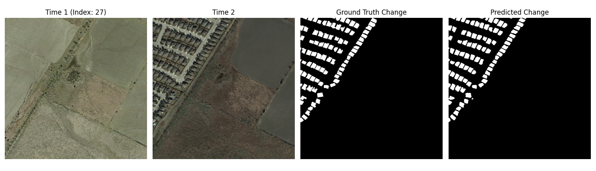
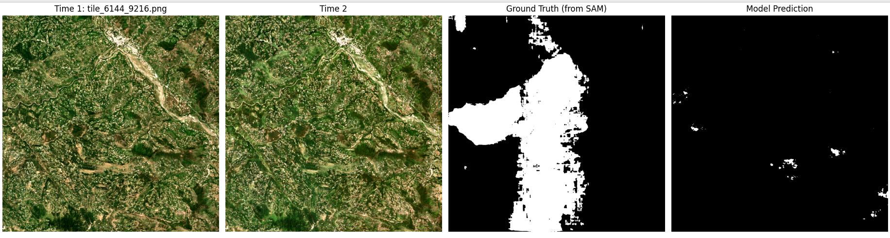

# 🛰️ SentinelChange-AI  
**Copernicus Sentinel-2 Change Detection with GPU-Accelerated Deep Learning (ChangeStar + SAM + ESRGAN)**

*High-resolution LEVIR-CD benchmark — ChangeStar fine-tuned baseline*

*Copernicus Sentinel-2 (10 m) experiment — work in progress, GPU optimization ongoing*

---

## 🌍 Overview

**SentinelChange-AI** is an applied research pipeline for **multi-temporal satellite change detection** using **Copernicus Sentinel-2 imagery**.  
It integrates **ChangeStar** for coarse semantic change prediction, **Segment Anything Model (SAM)** for precise boundary refinement, and **ESRGAN/RRDBNet** for super-resolving 10 m scenes to near-aerial visual quality.

Beyond accuracy, this repository emphasizes **GPU acceleration, profiling, and workload optimization** — ideal for researchers, practitioners, and AI engineers exploring **geospatial deep learning on high-volume remote-sensing data**.

---

## 🔑 Key Features

- 🛰️ **Copernicus Sentinel-2 Change Detection Pipeline** (10 m resolution)  
- ⚙️ **ChangeStar Deep Change-Detection Backbone** (Zheng et al., CVPR 2022)  
- ✂️ **SAM-Based Label Refinement** for high-quality masks  
- 🔍 **Automatic Sentinel-2 Pairing** by tile ID & year (MGRS)  
- 🧠 **Super-Resolution (ESRGAN / RRDBNet)** for visual enhancement  
- 🚀 **GPU-Optimized Training & Inference** workflows (CUDA / TorchRun)  
- 📊 **Benchmark-grade workloads** for Nsight profiling and GPU efficiency studies  

---

## 🧭 Attribution

This repository builds upon the open-source [**ChangeStar** framework by Zheng et al. (CVPR 2022)](https://github.com/Z-Zheng/ChangeStar).  
Model definitions, configuration templates, and baseline training logic are reused under their MIT license.  
All **Copernicus Sentinel-2 processing, SAM integration, ESRGAN upscaling**, and **GPU acceleration workflows** were independently developed by **Atul Vaish**.

---

## 📂 Repository Structure

